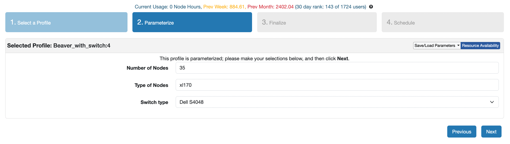
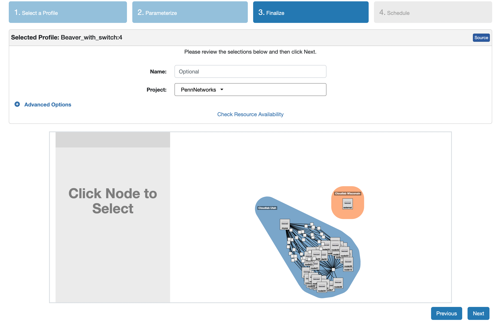
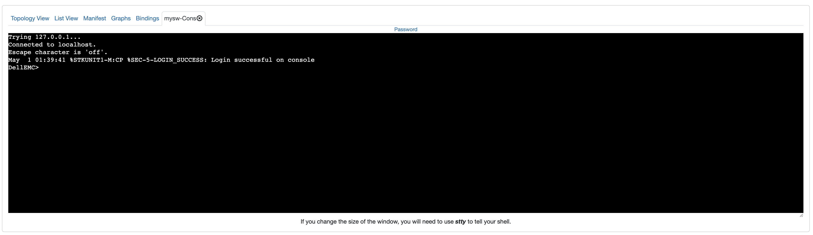
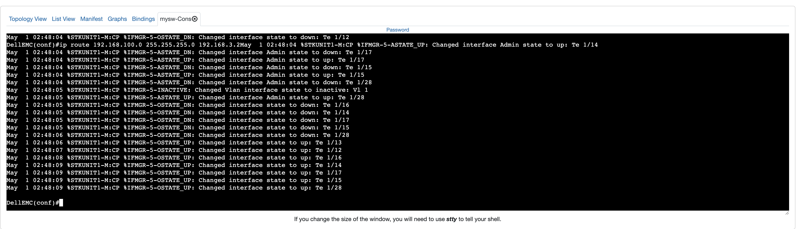

# Beaver

Beaver is a practical partial snapshot protocol that guarantees causal consistency under external traffic interference.
By exploiting the placement of software load balancers in data center networks and their associated communication pattern, Beaver not only requires minimal changes to today’s data center operations, but also eliminates any form of blocking to existing distributed communication and its related impact to user traffic.

## Repo Structure

The repo contains the prototype implementation of Beaver tested extensively on CloudLab.
It also packages the automated scripts for the ease of setting up the environment and reproducing the experiments on CloudLab.

* `beaver.py`: The entry point to set up the experiment environment, run the experiment, and collect the results---all from the local desktop.
* `cloudlab/`: The default folder containing (a) a dummy manifest file with contents to be replaced with the actual manifest file from the CloudLab portal and (b) the Beaver profile for the ease of instantiating CloudLab experiments.
* `install_env.sh`: The script to install the required dependencies on the machines.
* `backend/`: The backend server implementation, including the XDP program encoding typical SLB-related processing (re-computation of
checksums, NAT caching in a shared eBPF map, and the de-encapsulation of incoming packets) and Beaver's in-group process logic. It also includes the Linux tc to look up the NAT entries and perform the header transformations to replicate Direct Server Return (DSR).
* `client/`: A sample client implementation.
* `controller/`: Beaver's controller server that initiates, controls, collects the results of the snapshots. It also applies the detection algorithm for verifying the snapshots.
* `load_balancer/`: The software load balancer implementation that emulates the typical behvaiors using DPDK, including consistent hashing, caching, SLB-forwarding based on Virtual IP (VIP), and encapsulation. It also includes the optimistic gateway marking logic for Beaver.
* `uilts/`: The utility scripts for automating the experiments.

## Resource Requirements

Beaver has been tested extensively on CloudLab, and the artifact automates the process as much as possible for the ease of reproducing the experiments all on CloudLab.

* To include ECMP forwarding behavior in the experiment setup, the artifact requires reserving 1 dell-s4048 switch from CloudLab.

* Due to CloudLab's [wiring constraints](https://docs.cloudlab.us/hardware.html) with dell-s4048 switches, the artifact requires xl170 machines for instantiating global controller, software load balancers, backend servers, and so on.

* `cloudlab/beaver_profile.py` contains the profile for the ease of instantiating the experiment on Cloudlab, which includes 1 dell-s4048 switch, 1 `c220g2` node for the external client, and a user-specified number of `xl170` nodes.
A **minimum specification of 6 xl170 machines** is required to execute the experiments, in addition to the switch and a `c220g2` node (which the profile instantiates by default).
The maximum scale experiment requires a minimum reservation of 34 xl170 machines.

**Notes for resource reservation**

* CloudLab has around 5 dell-s4048 switches available which may imply contending resource reservation among multiple reviewers. Similar contention may occur for xl170 reservation especially for large-scale experiments.
* As the `dell-s4048` switch feature is relatively new, failed direct connectivity between xl170 node and the switch can occur. Thus, it is recommended to reserve more xl170 nodes than the minimum requirement (especially for a larger scale experiments). `beaver.py` will certify the working connectivity and give a warning if the effective number of xl170 nodes is less than required for the experiment.

## Experiment Setup with CloudLab / Kick-the-tires Instructions

We provide set-by-step instructions for reserving Beaver's resources on CloudLab and setting up the environment.
These steps need to be followed for each new CloudLab reservation.

0. Clone the Beaver repository and navigate to the root directory. Run `./setup.sh` to install the python3 dependencies for automated experiment management of remote machines from the local desktop.

1. Instantiate an experiment on CloudLab using the profile `cloudlab/beaver_profile.py` described above.

2. Specify a minimum of 6 xl170 nodes in the profile. It is recommended to reserve more xl170 nodes than the target to account for potential faulty phy connectivity between xl170 nodes and the `dell-s4048` switch (see resource requirements above).

3. Move on to finalize the experiment reservation.

4. Wait until the CloudLab experiment page shows status ready (it takes ~10 minutes for provisioning the `dell-s4048` before showing status ready). Then copy the XML contents under the `manifest` column (right next to the `List View` column) on the experiment profile page, and replace the contents in `cloudlab/manifest.xml` file.

5. Install dependencies on all machines in parallel by using `python3 beaver.py env` subcommand with the CloudLab user name (`--user_name`/`-u`) and the SSH private key file path (`--ssh_key` / `-k`).
   * Example command: `python3 beaver.py -u leoyu -k ~/.ssh/leoyu env`.
   * By default, it will reads the manifest file of path `cloudlab/manifest.xml` to extract the information for the CloudLab machines. Otherwise, specify the path to the manifest file using the `--manifest` / `-m` option.
   * The whole process takes around ~20 minutes to complete. The terminal will print `Finish configuring the environment for all the nodes!` to indicate successful environment set up.

6. Goto the CloudLab s4048 switch console: goto the `List View` of the CloudLab experiment profile => click the setting icon on the right of the page for the `dell-s4048` switch row => click `Console`.
   * We seeked to automate the experiments as much as possible. However, the only way to interact with the CloudLab s4048 switch is through typing the commands on CloudLab switch console webpage manually.
   * To make it easier, **each group of experiments** involves a **config step** (which **varies across experiments** due to changes in topologies etc!) that will print the switch commands to be copied to the switch console, AND a clear step which produces the commands to copy to the console to reset the switch state for the next experiment.

## Instructions for Reproducing the Experiments

### Getting Started (Read Carefully Before Starting)

* Read `Resource Requirements` section and instantiate the CloudLab experiment using the provided profile.
  * The minimum number of xl170 nodes to reserve is 6 for a scale of 2 SLBs (`|G|=2`).
  * See the table below for the minimum number of xl170 nodes for larger scales.

| `\|G\|` | Min # of xl170 nodes |
| ------- | -------------------- |
| 2       | 6                    |
| 4       | 10                   |
| 6       | 14                   |
| 8       | 18                   |
| 10      | 22                   |
| 12      | 26                   |
| 14      | 30                   |
| 16      | 34                   |

* Complete the steps in the section `Experiment Setup with CloudLab / Kick-the-tires Instructions` for each new CloudLab experiment reservation.
* Note that each group of experiments involve 3 phases:
  * Config phase: `beaver.py` will also print the switch commands that must be manually copied to the CloudLab switch console. It will also complain `The number of booked nodes is not enough,please reduce the scale.` if the effective number of xl170 nodes (due to faulty links) is less than required for the experiment.
  * Run phase: `beaver.py` will run the experiment automatically and collect the results.
  * Clear phase: `beaver.py` will also print the switch commands that must be manually copied to the CloudLab switch console to reset the switch state.

**IMPORTANT: notes to copy the auto-generated commands to the switch console**

* Before copying command, hit `ENTER` to make sure you see the `DellEMC(conf)>` prompt on the console.

* After copying the commands and waiting for its execution (typically takes around 10 seconds), hit `ENTER` again to make sure the last command line is executed as well. `DellEMC>` (rather than, e.g., `DellEMC(conf)>`) will appear right after.

### Reproduce Figure 10(a) and 10(b)

Please follow the command below **in order** to obtain the snapshot frequency without or with parallelism, when `|G|=2` (requiring 6 xl170 nodes), remember to replace `leoyu` and `.ssh/leoyu` with your CloudLab username and SSH private key path:

1. Run config subcommand without parallelism: `python3 beaver.py -u leoyu -k ~/.ssh/leoyu rate -s 2 -o config`.

2. Copy all printed switch commands starting with the line with enable (inclusive) to the CloudLab switch console. Remember to hit `ENTER` to ensure the appearance of the `DellEMC>` prompt before and after copying the commands per guidance above.

3. Run experiment with `|G|=2` without parallelism (<1min): `python3 beaver.py -u leoyu -k ~/.ssh/leoyu rate -s 2 -o run`

4. The digest of the experiment including the snapshot frequency number will be printed on the terminal and saved to `results/freq/freq_2_<timestamp>.txt`. One may run step 3 multiple times.

5. Run experiment with `|G|=2` with parallelism (<1min): `python3 beaver.py -u leoyu -k ~/.ssh/leoyu rate -p -s 2 -o run`
   * Note that this experiment shares the same switch configuration so no need to execute the clear phase and cconfig phase again.

6. The digest of the experiment including the snapshot frequency number with parallelism will be printed on the terminal and saved to `results/freq/freq_para_2_<timestamp>.txt`.

7. Run clear subcommand AND copy the auto-generated switch commands to the CloudLab switch console: `python3 beaver.py -u leoyu -k ~/.ssh/leoyu rate -s 2 -o clear`.

To obtain the snapshot frequency for larger `|G|`, one needs to reserve more xl170 nodes and follow the same steps above.
The workflow from step 1 to 7 is the same except replacing the scale argument `-s 2` with `-s 4`, `-s 6`, `-s 8`, `-s 10`, `-s 12`, `-s 14`, and `-s 16` respectively.

## Further Questions

For more details, please refer to the paper Beaver: Practical Partial Snapshots for Distributed Cloud Services (OSDI 2024).

Feel free to post issues if any question arises or email `leoyu@seas.upenn.edu`.
