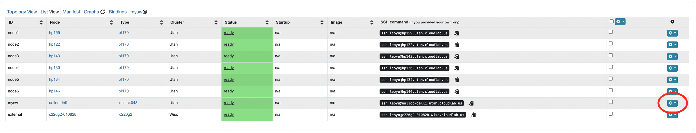

# Beaver

Beaver is a practical partial snapshot protocol that guarantees causal consistency under external traffic interference.
By exploiting the placement of software load balancers in data center networks and their associated communication pattern, Beaver not only requires minimal changes to today’s data center operations, but also eliminates any form of blocking to existing distributed communication and its related impact to user traffic.

- [Beaver](#beaver)
  - [Repo Structure](#repo-structure)
  - [Resource Requirements](#resource-requirements)
  - [Experiment Setup with CloudLab / Kick-the-tires Instructions](#experiment-setup-with-cloudlab--kick-the-tires-instructions)
  - [Instructions for Reproducing the Experiments](#instructions-for-reproducing-the-experiments)
    - [Getting Started (Read Carefully Before Starting)](#getting-started-read-carefully-before-starting)
    - [Reproduce Figure 10(a) and 10(b)](#reproduce-figure-10a-and-10b)
    - [Reproduce Figure 11](#reproduce-figure-11)
    - [Reproduce Figure 12](#reproduce-figure-12)
    - [Reproduce Figure 13](#reproduce-figure-13)
    - [Reproduce Figure 14](#reproduce-figure-14)
    - [Reproduce Table 3](#reproduce-table-3)
  - [Further Questions](#further-questions)

## Repo Structure

The repo contains the prototype implementation of Beaver tested extensively on CloudLab.
It also packages the automated scripts for the ease of setting up the environment and reproducing the experiments on CloudLab.

* `beaver.py`: The entry point to set up the experiment environment, run the experiment, and collect the results---all from the local desktop.
* `cloudlab/`: The default folder containing (a) a dummy manifest file with contents to be replaced with the actual manifest file from the CloudLab portal and (b) the Beaver profile for the ease of instantiating CloudLab experiments.
* `install_env.sh`: The script to install the required dependencies on the machines.
* `backend/`: The backend server implementation, including the XDP program encoding typical SLB-related processing (re-computation of
checksums, NAT caching in a shared eBPF map, and the de-encapsulation of incoming packets) and Beaver's in-group process logic. It also includes the Linux tc to look up the NAT entries and perform the header transformations to replicate Direct Server Return (DSR).
* `client/`: A sample client implementation.
* `controller/`: Beaver's controller server that initiates, controls, collects the results of the snapshots. It also applies the detection algorithm for verifying the snapshots.
* `load_balancer/`: The software load balancer implementation that emulates the typical behvaiors using DPDK, including consistent hashing, caching, SLB-forwarding based on Virtual IP (VIP), and encapsulation. It also includes the optimistic gateway marking logic for Beaver.
* `uilts/`: The utility scripts for automating the experiments.

## Resource Requirements

Beaver has been tested extensively on CloudLab, and the artifact automates the process as much as possible for the ease of reproducing the experiments all on CloudLab.

* To include ECMP forwarding behavior in the experiment setup, the artifact requires reserving 1 dell-s4048 switch from CloudLab.

* Due to CloudLab's [wiring constraints](https://docs.cloudlab.us/hardware.html) with dell-s4048 switches, the artifact requires xl170 machines for instantiating global controller, software load balancers, backend servers, and so on.

* `cloudlab/beaver_profile.py` contains the profile for the ease of instantiating the experiment on Cloudlab, which includes 1 dell-s4048 switch, 1 `c220g2` node for the external client, and a user-specified number of `xl170` nodes.
A **minimum specification of 6 xl170 machines** is required to execute the experiments, in addition to the switch and a `c220g2` node (which the profile instantiates by default).
The maximum scale experiment requires a minimum reservation of 34 xl170 machines.

**Notes for resource reservation**

* CloudLab has around 5 dell-s4048 switches available which may imply contending resource reservation among multiple reviewers. Similar contention may occur for xl170 reservation especially for large-scale experiments.
* As the `dell-s4048` switch feature is relatively new, failed direct connectivity between xl170 node and the switch can occur. Thus, it is recommended to reserve more xl170 nodes than the minimum requirement (especially for a larger scale experiments). `beaver.py` will certify the working connectivity and give a warning if the effective number of xl170 nodes is less than required for the experiment.

## Experiment Setup with CloudLab / Kick-the-tires Instructions

We provide set-by-step instructions for reserving Beaver's resources on CloudLab and setting up the environment.
These steps need to be followed for each new CloudLab reservation.

0. Clone the Beaver repository and navigate to the root directory. Run `./setup.sh` to install the python3 dependencies for automated experiment management of remote machines from the local desktop.

1. Instantiate an experiment on CloudLab using the profile `cloudlab/beaver_profile.py` described above.

2. Specify a minimum of 6 xl170 nodes in the CloudLab reservation parameter. It is recommended to reserve more xl170 nodes than the target to account for potential faulty phy connectivity between xl170 nodes and the `dell-s4048` switch (see resource requirements above).

3. Move on to finalize the experiment reservation.

4. Wait until the CloudLab experiment page shows status ready (it takes ~10 minutes for provisioning the `dell-s4048` before showing status ready). Then copy the XML contents under the `manifest` column (right next to the `List View` column) on the experiment profile page, and replace the contents in `cloudlab/manifest.xml` file.

5. Install dependencies on all machines in parallel by using `python3 beaver.py env` subcommand with the CloudLab user name (`--user_name`/`-u`) and the SSH private key file path (`--ssh_key` / `-k`).
   * Example command: `python3 beaver.py -u leoyu -k ~/.ssh/leoyu env`.
   * By default, it will reads the manifest file of path `cloudlab/manifest.xml` to extract the information for the CloudLab machines. Otherwise, specify the path to the manifest file using the `--manifest` / `-m` option.
   * The whole process takes around ~20 minutes to complete. The terminal will print `Finish configuring the environment for all the nodes!` to indicate successful environment set up.

6. Goto the CloudLab s4048 switch console: goto the `List View` of the CloudLab experiment profile => click the setting icon on the right of the page for the `dell-s4048` switch row => click `Console`.
   * We seeked to automate the experiments as much as possible. However, the only way to interact with the CloudLab s4048 switch is through typing the commands on CloudLab switch console webpage manually.
   * To make it easier, **each group of experiments** involves a **config step** (which **varies across experiments** due to changes in topologies etc!) that will print the switch commands to be copied to the switch console, AND a clear step which produces the commands to copy to the console to reset the switch state for the next experiment.

## Instructions for Reproducing the Experiments

### Getting Started (Read Carefully Before Starting)

* Read `Resource Requirements` section and instantiate the CloudLab experiment using the provided profile.
  * The minimum number of xl170 nodes to reserve is 6 for a scale of 2 SLBs (`|G|=2`). Unless otherwise mentioned, this is sufficient for reproducing most experiments. Again, redundant nodes are recommended during reservation.
  * Some data points involve a larger scale configuration; see the table below for the minimum number of xl170 nodes required.

| `\|G\|` | Min # of xl170 nodes |
| ------- | -------------------- |
| 2       | 6                    |
| 4       | 10                   |
| 6       | 14                   |
| 8       | 18                   |
| 10      | 22                   |
| 12      | 26                   |
| 14      | 30                   |
| 16      | 34                   |

* Complete the steps in the section `Experiment Setup with CloudLab / Kick-the-tires Instructions` to set up environment for each new CloudLab experiment reservation.
* In principle, **each experiment run** requires a mandatory config phase (before run) and a mandatory clear phase (after run), unless it shares the same switch configuration with another experiment:
  * Config phase: `beaver.py` will also print the switch commands that must be manually copied to the CloudLab switch console. It will also complain `The number of booked nodes is not enough,please reduce the scale.` if the effective number of xl170 nodes (due to faulty links) is less than required for the experiment.
  * Run phase: `beaver.py` will run the experiment automatically and collect the results.
  * Clear phase: `beaver.py` will also print the switch commands that must be manually copied to the CloudLab switch console to reset the switch state and clear up folders on the remote machines.

**IMPORTANT: notes to copy the auto-generated commands to the switch console**

* Before copying command, hit `ENTER` to make sure you see the `DellEMC>` prompt on the console.

* After copying the commands and waiting for its execution (typically takes around 10 seconds), hit `ENTER` again to make sure the last command line is executed as well. `DellEMC>` (rather than, e.g., `DellEMC(conf)>`) will appear right after.

### Reproduce Figure 10(a) and 10(b)

Please follow the command below **in order** to obtain the snapshot frequency without or with parallelism, when `|G|=2` (requiring 6 working xl170 nodes), remember to replace `leoyu` and `.ssh/leoyu` with your CloudLab username and SSH private key path:

1. Run config phase without parallelism (<1min): `python3 beaver.py -u leoyu -k ~/.ssh/leoyu rate -s 2 -o config`.

2. Copy all printed switch commands starting with the line with enable (inclusive) to the CloudLab switch console. Remember to hit `ENTER` to ensure the appearance of the `DellEMC>` prompt before and after copying the commands per guidance above.

3. Run experiment with `|G|=2` without parallelism (~1min): `python3 beaver.py -u leoyu -k ~/.ssh/leoyu rate -s 2 -o run`

4. The digest of the experiment including the snapshot frequency number will be printed on the terminal and saved to `results/freq/freq_2_<timestamp>.txt`. One can run step 3 multiple times to sample multiple measurements.

5. Run experiment with `|G|=2` with parallelism (<1min): `python3 beaver.py -u leoyu -k ~/.ssh/leoyu rate -p -s 2 -o run`
   * Note that this experiment shares the same switch configuration so no need to execute the clear phase after the previous run and the config phase before this run.

6. The digest of the experiment including the snapshot frequency number with parallelism will be printed on the terminal and saved to `results/freq/freq_para_2_<timestamp>.txt`.

7. Run clear phase **AND copy the auto-generated switch commands** to the CloudLab switch console: `python3 beaver.py -u leoyu -k ~/.ssh/leoyu rate -s 2 -o clear`.

To obtain the snapshot frequency for larger `|G|`:

* One needs to reserve more xl170 nodes.
* Repeat step 1 to 7 one-by-one except replacing the scale argument `-s 2`. E.g., for `|G|=4`, use `-s 4`.
* The precise numbers may vary across runs, but the trends should be consistent: (1) The snapshot frequency with parallelism is significantly higher than that without parallelism, and (2) the snapshot frequency decreases as the scale increases on average.

### Reproduce Figure 11

Follow the command below **in order** to obtain the effective snapshot rate for different snapshot frequencies, given `|G|=2`:

1. Run config phase (<1min): `python3 beaver.py -u leoyu -k ~/.ssh/leoyu accuracy -s 2 -f 1024 -o config`

2. Copy the generated switch commands to the console as before.

3. Run experiment with frequency 1024: `python3 beaver.py -u leoyu -k ~/.ssh/leoyu accuracy -s 2 -f 1024 -o run`
   * Results with effective snapshot rate will be printed and fetched to `results/accuracy/freq_1024_2_<timestamp>.txt`.

4. Similarly, run the commands below to sample results for 2048, 4096, 8192, 16384, 32768, 65536, and 131072 frequencies, which share the same configuration of switches etc:
   * `python3 beaver.py -u leoyu -k ~/.ssh/leoyu accuracy -s 2 -f 2048 -o run`
   * `python3 beaver.py -u leoyu -k ~/.ssh/leoyu accuracy -s 2 -f 4096 -o run`
   * `python3 beaver.py -u leoyu -k ~/.ssh/leoyu accuracy -s 2 -f 8192 -o run`
   * `python3 beaver.py -u leoyu -k ~/.ssh/leoyu accuracy -s 2 -f 16384 -o run`
   * `python3 beaver.py -u leoyu -k ~/.ssh/leoyu accuracy -s 2 -f 32768 -o run`
   * `python3 beaver.py -u leoyu -k ~/.ssh/leoyu accuracy -s 2 -f 65536 -o run`
   * `python3 beaver.py -u leoyu -k ~/.ssh/leoyu accuracy -s 2 -f 131072 -o run`

5. Run clear phase **AND copy the auto-generated switch commands** to the CloudLab switch console: `python3 beaver.py -u leoyu -k ~/.ssh/leoyu accuracy -s 2 -f 1024 -o clear`.

To obtain the effective snapshot rate for larger `|G|`:

* Repeat step 1 to 5 one-by-one except replacing the scale argument `-s 2`. E.g., for `|G|=4`, use `-s 4`. Note that 131072 is not achievable for `|G|=16`.
* The precise numbers may vary across runs, but one should expect the effective snapshot rate to be close to 1 (that is, 100%).

### Reproduce Figure 12

1. Sample measurements for the time to form the external causal chain for intra-DC setting:
   * Run config phase AND copy the switch command to the CloudLab console: `python3 beaver.py -u leoyu -k ~/.ssh/leoyu latency -lt intra -o config`
   * Run measurement with `python3 beaver.py -u leoyu -k ~/.ssh/leoyu latency -lt intra -o run`
     * The results (in nanoseconds) will be saved to `results/latency/latency_intra_<timestamp>.txt`.
     * For faster experiment runs, each run samples 1000 measurements by default. One can run this step multiple times to sample more measurements.
   * Run clear phase AND copy the switch command to the CloudLab console: `python3 beaver.py -u leoyu -k ~/.ssh/leoyu latency -lt intra -o clear`
   * Expected observation: Typical numbers should be around 10s of us to 100s of us. For Beaver, what matters is the minimum, and the sampled measurements should be greater than 33us.

2. For inter-DC setting:
   * Run config phase AND copy the switch command to the CloudLab console: `python3 beaver.py -u leoyu -k ~/.ssh/leoyu latency -lt inter -o config`
   * Similarly, run the experiment to sample measurement: `python3 beaver.py -u leoyu -k ~/.ssh/leoyu latency -lt inter -o run`
     * The results (in nanoseconds) will be saved ti `results/latency/latency_inter_<timestamp>.txt`
   * Run clear phase AND copy the switch command to the CloudLab console: `python3 beaver.py -u leoyu -k ~/.ssh/leoyu latency -lt inter -o clear`
   * Expected observation: The typical numbers are around 10s of ms time scale, and much higher than intra-DC values. Again, what matters is that measurements are greater than the minimum 33us which should hold trivially.

3. For internet settings:
   * `python3 beaver.py -u leoyu -k ~/.ssh/leoyu latency -lt internet -o config`
   * `python3 beaver.py -u leoyu -k ~/.ssh/leoyu latency -lt internet -o run`
   * `python3 beaver.py -u leoyu -k ~/.ssh/leoyu latency -lt internet -o clear`
   * Expected observation: The concrete numbers may vary because it depends on the physical location of your local desktop. Typical values should be 10s of ms. Again, what matters is that measurements are greater than the minimum 33us which should hold trivially.

### Reproduce Figure 13

*Detailed notes TBA.*

* `python3 beaver.py -u leoyu -k ~/.ssh/leoyu bound -s 2 -o config`
* `python3 beaver.py -u leoyu -k ~/.ssh/leoyu bound -s 2 -o run`
* `python3 beaver.py -u leoyu -k ~/.ssh/leoyu bound -s 2 -o clear`

### Reproduce Figure 14

*Detailed notes TBA.*

**Reproduce Figure 14(a)**

* Run config phase AND copy the switch command to CloudLab console: `python3 beaver.py -u leoyu -k ~/.ssh/leoyu load -s 2 -lt iperf-10 -o config`
* Run experiment for iperf with load 20%:
  * Without Beaver: `python3 beaver.py -u leoyu -k ~/.ssh/leoyu load -s 2 -lt iperf-20 -o run`
  * With Beaver: `python3 beaver.py -u leoyu -k ~/.ssh/leoyu load -s 2 -lt iperf-20 -ss -o run`
  * Results will be saved under `results/load_2_2_<timestamp>_<client_node_id>.txt`
* Run clear phase AND copy the switch command to the CloudLab console: `python3 beaver.py -u leoyu -k ~/.ssh/leoyu load -s 2 -lt iperf-10 -o clear`

Observation: Concrete numbers may vary, but the key is that the number with Beaver should not be significantly smaller than that without Beaver, and any discrepancy is a result of randomness in particular experiment runs.

**Reproduce Figure 14(b)**

* `python3 beaver.py -u leoyu -k ~/.ssh/leoyu load -s 2 -lt cassandra-rw -ss -o config`

* `python3 beaver.py -u leoyu -k ~/.ssh/leoyu load -s 2 -lt cassandra-rw -o run` (~5min)
* `python3 beaver.py -u leoyu -k ~/.ssh/leoyu load -s 2 -lt cassandra-rw -ss -o run`
* `python3 beaver.py -u leoyu -k ~/.ssh/leoyu load -s 2 -lt cassandra-r -o run`
* `python3 beaver.py -u leoyu -k ~/.ssh/leoyu load -s 2 -lt cassandra-r -ss -o run`
* `python3 beaver.py -u leoyu -k ~/.ssh/leoyu load -s 2 -lt cassandra-s -o run`
* `python3 beaver.py -u leoyu -k ~/.ssh/leoyu load -s 2 -lt cassandra-s -ss -o run`

* `python3 beaver.py -u leoyu -k ~/.ssh/leoyu load -s 2 -lt cassandra-rw -ss -o clear`

Recommended (? actually larger scale may give more stable results) to use a scale of 2 (-s 2), but increasing the scale should give similar observations, that is close to 1.

### Reproduce Table 3

The experiments below only requires 6 valid xl170 nodes.

1. Run config phase for the experiment: `python3 beaver.py -u leoyu -k ~/.ssh/leoyu bot -r 0 -st poll -o config`

2. Copy the printed switch commands to the CloudLab portal. No need to run the clear phase as all experiments for Table 3 share the same switch configuration.

3. Run the following commands to obtain TP, FP, TN, FN results for bot ratio = 0% for different approaches. After each run, the results will be printed and saved to `results/bot/bot_<snapshot_type>_<bot_ratio>_<timestamp>.txt`.
   * Polling: `python3 beaver.py -u leoyu -k ~/.ssh/leoyu bot -r 0 -st poll -o run`
   * Laiyang (L-Y): `python3 beaver.py -u leoyu -k ~/.ssh/leoyu bot -r 0 -st laiyang -o run`
   * Beaver: `python3 beaver.py -u leoyu -k ~/.ssh/leoyu bot -r 0 -st beaver -o run`

4. To obtain results for bot ratio = 5%:
   * Polling: `python3 beaver.py -u leoyu -k ~/.ssh/leoyu bot -r 0.05 -st poll -o run`
   * Laiyang (L-Y): `python3 beaver.py -u leoyu -k ~/.ssh/leoyu bot -r 0.05 -st laiyang -o run`
   * Beaver: `python3 beaver.py -u leoyu -k ~/.ssh/leoyu bot -r 0.05 -st beaver -o run`

5. To obtain results for bot ratio = 10%:
   * Polling: `python3 beaver.py -u leoyu -k ~/.ssh/leoyu bot -r 0.1 -st poll -o run`
   * Laiyang (L-Y): `python3 beaver.py -u leoyu -k ~/.ssh/leoyu bot -r 0.1 -st laiyang -o run`
   * Beaver: `python3 beaver.py -u leoyu -k ~/.ssh/leoyu bot -r 0.1 -st beaver -o run`

6. Run clear phase AND copy the printed switch commands to CloudLab portal: `python3 beaver.py -u leoyu -k ~/.ssh/leoyu bot -r 0 -st poll -o clear`

Although the precise numbers may differ across runs, the key observations should hold:
* When bot ratio = 0%, Beaver should only give TN, whereas Polling and Laiyang may give FP.
* When bot ratio = 5%, Beaver results are correct, that is, only TP or TN, whereas Polling and Laiyang may give FP or FN.
* Similarly, when bot ratio = 10%, Beaver results are correct, that is, only TP or TN, whereas Polling and Laiyang may give FP or FN.

## Further Questions

For more details, please refer to the paper Beaver: Practical Partial Snapshots for Distributed Cloud Services (OSDI 2024).

Feel free to post issues if any question arises or email `leoyu@seas.upenn.edu`.
